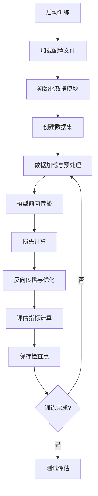

# 🚀 TrackTacular 训练流程详细注释总结

本文档总结了 TrackTacular 从数据加载到损失评估的完整训练流程，所有关键代码文件都已添加详细的中文注释。

## 📋 已完成注释的文件列表

### 1. 配置文件 ✅
- **`configs/t_fit.yml`** - 训练器配置（GPU、epochs、callbacks等）
- **`configs/d_wildtrack.yml`** - Wildtrack数据集配置（分辨率、边界、相机数等）
- **`configs/m_liftnet.yml`** - Liftnet模型配置（架构、特征维度等）

### 2. 数据加载模块 ✅
- **`datasets/wildtrack_dataset.py`** - Wildtrack数据集基类（标定、图像路径、坐标转换）
- **`datasets/pedestrian_dataset.py`** - 数据集包装类（数据增强、GT生成、坐标变换）
- **`datasets/pedestrian_datamodule.py`** - PyTorch Lightning数据模块（DataLoader配置）

### 3. 模型架构 ✅
- **`models/liftnet.py`** - 核心Liftnet模型（2D→3D特征提升、BEV检测）

### 4. 损失函数 ✅
- **`models/loss.py`** - 各种损失函数（Focal Loss、旋转损失、平衡MSE等）

### 5. 主训练模型 ✅
- **`world_track.py`** - 训练流程核心（模型初始化、前向传播、损失计算）

## 🔄 完整训练流程图



## 📊 数据流详解

### 1. 数据加载阶段
```python
# 配置解析
configs = [t_fit.yml, d_wildtrack.yml, m_liftnet.yml]

# 数据集初始化
base_dataset = Wildtrack(data_dir)  # 基础数据集
pedestrian_dataset = PedestrianDataset(base_dataset)  # 包装数据集
datamodule = PedestrianDataModule(pedestrian_dataset)  # Lightning数据模块
```

### 2. 单个样本处理流程
```python
# 1. 加载多视角图像 (7相机 × 3通道 × H × W)
imgs = load_multiview_images()

# 2. 应用数据增强 (resize + crop + 归一化)
imgs = apply_augmentation(imgs)

# 3. 生成Ground Truth
center_bev = generate_bev_heatmap()      # BEV中心点热图
offset_bev = generate_bev_offset()       # BEV偏移量
center_img = generate_img_heatmap()      # 图像中心点热图

# 4. 坐标系转换
world_coords → bev_coords → memory_coords
```

### 3. 模型前向传播
```python
# Liftnet 前向传播流程
rgb_images → 2D_features + depth_prediction
2D_features × depth_weights → 3D_voxel_features  # Lifting关键步骤
3D_voxel_features → BEV_features                 # 压缩到BEV
BEV_features + temporal_cache → final_BEV        # 时序融合
final_BEV → detection_outputs                    # 解码检测结果
```

### 4. 损失计算
```python
# 多任务损失组合
total_loss = (
    10 * focal_loss(center_pred, center_gt) +      # 中心点检测
    10 * l1_loss(offset_pred, offset_gt) +         # 偏移回归  
    smooth_l1_loss(tracking_pred, tracking_gt) +   # 跟踪特征
    l1_loss(size_pred, size_gt) +                  # 尺寸回归
    rotation_loss(rot_pred, rot_gt) +              # 旋转回归
    image_loss(img_pred, img_gt)                   # 图像空间损失
) + uncertainty_losses                              # 不确定性权重
```

## 🎯 关键技术要点

### 1. **多视角特征融合**
- **方式1**: 加权平均（基于观测次数）
- **方式2**: 3D卷积网络融合

### 2. **时序信息利用**
- 缓存前一帧BEV特征
- 计算时序偏移用于跟踪
- 时序融合网络

### 3. **数据增强策略**
- 图像：随机resize + crop
- 坐标：随机平移扰动
- BEV：随机翻转

### 4. **损失函数设计**
- **Focal Loss**: 解决正负样本不平衡
- **不确定性权重**: 自动平衡多任务损失
- **多尺度监督**: BEV + 图像空间

### 5. **评估指标**
- **MODA/MODP**: 检测精度
- **MOTA/MOTP**: 跟踪精度
- **Recall/Precision**: 基础指标

## 🚀 启动训练命令

```bash
python world_track.py fit \
    -c configs/t_fit.yml \
    -c configs/d_wildtrack.yml \
    -c configs/m_liftnet.yml
```

## 📁 项目结构

```
TrackTacular/WorldTrack/
├── configs/                 # 配置文件
│   ├── t_fit.yml           # 训练配置
│   ├── d_wildtrack.yml     # 数据配置  
│   └── m_liftnet.yml       # 模型配置
├── datasets/               # 数据加载
│   ├── wildtrack_dataset.py
│   ├── pedestrian_dataset.py
│   └── pedestrian_datamodule.py
├── models/                 # 模型架构
│   ├── liftnet.py         # 主要模型
│   └── loss.py            # 损失函数
├── evaluation/            # 评估工具
│   ├── mod.py            # MODA/MODP计算
│   └── mot_bev.py        # MOTA/MOTP计算
└── world_track.py        # 主训练脚本
```

## 🎉 总结

通过详细的中文注释，现在可以清楚地理解：

1. **数据流**: 从原始图像到BEV检测结果的完整转换过程
2. **模型架构**: Liftnet如何将2D特征提升到3D BEV空间
3. **训练流程**: 损失计算、优化、评估的完整循环
4. **关键技术**: 多视角融合、时序建模、多任务学习

所有代码都已添加详细注释，便于理解和进一步开发！✨
